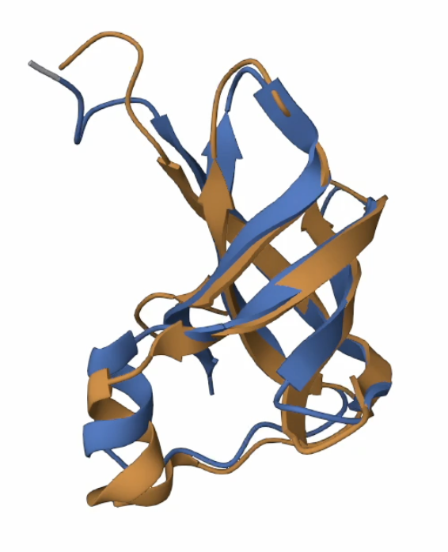
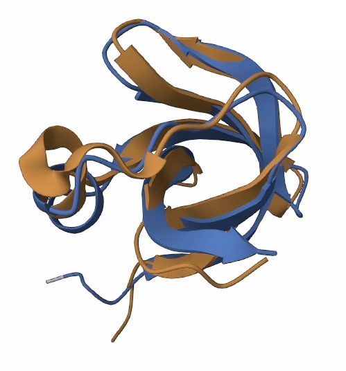

  
  

## CS492(B) Project Team 4
### Third-party libraries
- Install [omegafold](https://github.com/HeliXonProtein/OmegaFold)
- Install [FoldX](https://foldxsuite.crg.eu/) and place executable inside the working directory

### Environment
- Install PyTorch version 1.12.0 compatible with your CUDA version
- Other dependencies can be found in `requirements.txt`

### Data and Pretrained checkpoints 
The [dataset](https://www.proteingym.org/) and pretrained omegafold checkpoint will be automatically downloaded when you run the code.

### Code
- `baselines.py`: test random mutation and genetic algorithm baseline
- `train.py`: train function predictor GNN
- `optimize.py`: optimize proteins using our definition of state and action
- `optimize_onehot.py`: optimize proteins given one-hot encoded sequence as state (ablation)